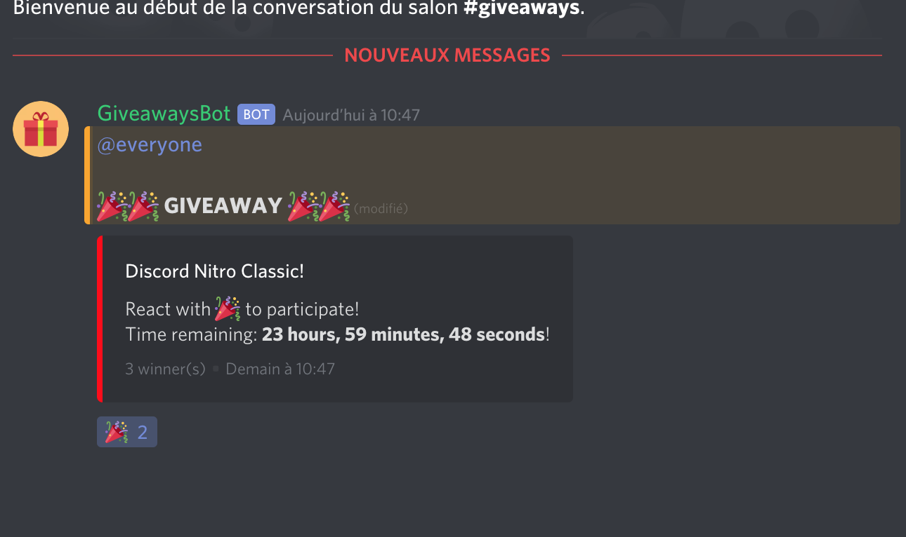

* `reroll-giveaway` command
* `end-giveaway` command

</img>
</img>

## Install

* Clone repository:
```sh
git clone https://github.com/Sail100/giveawaybot
```

* Fill configuration (config.json):
```json
{
    "token": "Your discord bot token",
    "prefix": "g!",
    "everyoneMention": true,
    "hostedBy": true
}
```

* Install dependencies:
```sh
npm install
```

* Start:
```sh
node index.js
```
